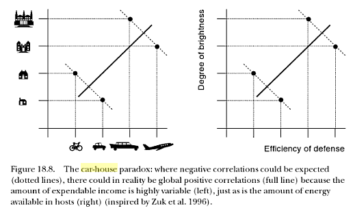

Multivariate analyses are one of the potential targets of modern mixed modeling tools.  Mixed model approaches have some advantages over
classical multivariate ANOVA (MANOVA) techniques; in particular,
they allow for unbalanced data and relaxation of some of the
usual assumptions of compound symmetry and sphericity
(e.g. David Howell discusses these issues [here][howell]).

[howell]: http://www.uvm.edu/~dhowell/methods7/Supplements/Mixed%20Models%20Repeated/Mixed%20Models%20for%20Repeated%20Measures1.pdf
In approximate order of increasing technical difficulty, one might be interested in fitting models where the different elements of the multivariate response vector are

1. *exchangeable*, i.e. all elements have identical variance, and the correlations between pairs of elements are all identical (this correlation structure is known as *compound symmetry*)
2. non-exchangeable and *unstructured* (i.e. no constraints on the pattern of the correlation matrix), possibly differing variances, with the distribution of individual responses chosen from the exponential family with fixed scale parameters (e.g. binomial, Poisson)
3. non-exchangeable, unstructured, normally distributed responses
4. structured normal or non-normal responses
5. multi-type responses (i.e. the elements of the response vector are drawn from different distributions, e.g. normal and Poisson)

Case #1 is easy in any modern mixed model software. It
can be implemented by defining a simple
intercept-level random effect associated with each vector
of responses (although this approach does slightly constrain
the correlation structure: the among-pair correlations must all be
identical and *non-negative*).

*(Would this list be more useful in the form of a cross-tabulation?)*

Probably the most capable mixed model packages in the R ecosystem
at present are `nlme`, `lme4`, and `MCMCglmm`.
* `nlme` is fairly old, but well-established and flexible. It only
handles normally distributed responses (except via the `glmmPQL`
extension in the `MASS` package), but it allows for a range
of correlation structures for residuals (*R-side effects*)
[cases #1, #3, #4 (normal only)]
* `lme4` is newer than `nlme`, probably faster for large
datasets, and handles GLMMs natively. R-side effects are not implemented.
[cases #1, #2, #3 (with difficulty)]
* `MCMCglmm` is also fairly new, and handles GLMMs, multi-type models, and
some R-side effects, although fewer than `nlme`. [cases #1, #2, #3, #4 (a few normal cases only), #5]

Here I'm going to look at case #3, especially illustrating how it can be done in `MCMCglmm` (easily) and `lme4`, with an example from the `MCMCglmm` "CourseNotes" vignette
(`vignette("CourseNotes",package="MCMCglmm")`):

*discuss other options ... ASREML?? INLA?? ADMB??*

# Preliminaries and simulating 'data'

```{r prelims,message=FALSE}
library(MCMCglmm)
library(lme4)
library(ggplot2)
library(reshape2)
theme_set(theme_bw())
```

Description from the `MCMCglmm` [course notes vignette](http://cran.r-project.org/web/packages/MCMCglmm/vignettes/CourseNotes.pdf):

> Lets imagine there was only one unmeasured variable: 
> disposable income. There are repeatable differences between individuals
> in their disposable income, but also some variation within individuals across
> the four years. Likewise, people vary in what proportion of their disposable
> income they are willing to spend on a holiday versus a car, but this also changes from year to year

```{r simex}
set.seed(102)
n_indiv <- 200
n_per_indiv <- 4
n_tot <- n_indiv*n_per_indiv
id<-gl(n_indiv,n_per_indiv) ## generate identifier columns
```

Per-individual wealth is normally distributed; yearly wealth
is represented as an added yearly component (equal variance for
each component).
```{r simex_wealth}
av_wealth <- rlnorm(n_indiv, 0, 1)  ## avg wealth of individuals
ac_wealth <- av_wealth[id]+rlnorm(n_tot, 0, 1)  ## wealth in each year:
```

The fraction of wealth spent on the car varies among individuals
(with a mean of 0.5); the yearly variation within individuals
is distributed around this value, with a larger variance
(sum of shape parameters = 2 rather than 20)

```{r simex_ratio}
av_ratio <- rbeta(n_indiv,10,10)  ## 50/50, close to Gaussian
## car/holiday ratio by year (larger shape parameter/less variability)
ac_ratio <- rbeta(n_tot, 2*av_ratio[id], 2*(1-av_ratio[id]))
```

Split wealth by ratio (not sure why we're raising to the 0.25
power, nor why `y.car+y.hol` doesn't add up to `ac.wealth`?)
```{r simex_spend}
y.car<-(ac_wealth*ac_ratio)^0.25 
y.hol<-(ac_wealth*(1-ac_ratio))^0.25 
Spending<-data.frame(y.hol, y.car, id)
```

```{r plot1}
(g0 <- qplot(y.hol,y.car,data=Spending)+geom_smooth(method="lm"))+
  labs(x="Holiday spending",y="Car spending")
```

It's instructive to look at the regression lines by `id`, which
are noisy but generally have a negative slope ...
```{r plot1B}
g0 + geom_smooth(method="lm",se=FALSE,colour=adjustcolor("gray",alpha=0.3),
                  aes(group=id))
```

# Models

## Naive regression

```{r reg0}
m0 <- lm(y.car~y.hol,data=Spending)
```

Results:
```{r reg0res,echo=FALSE}
(res_reg0 <- c(est=unname(coef(m0)["y.hol"]),
               setNames(confint(m0)["y.hol",],c("lwr","upr"))))
```
*Note: results can differ a fair amount depending on random-number seed (using
`set.seed(101)` gave a much larger $R^2$/lower $p$-value)*

## MCMCglmm

Replicate `MCMCglmm` results from the Course Notes:
```{r MCMCglmmfit1,cache=TRUE}
m1_id <- MCMCglmm(y.car ~ y.hol, random = ~id,
   data = Spending, verbose = FALSE)
m1_idyr <- MCMCglmm(cbind(y.hol, y.car) ~ trait - 1, 
                  random = ~us(trait):id, rcov = ~us(trait):units,
    data = Spending, family = c("gaussian", "gaussian"),
    verbose = FALSE)
```

Compute regression coefficients for `car` as a function of `holiday` (ratios of car-holiday covariance to holiday variance at each level):

```{r MCMCglmm_deriv}
mm <- as.data.frame(m1_idyr$VCV)
rd <- setNames(mm,
               gsub("trait","",names(mm)))
id.regression <- with(rd, `y.car:y.hol.id`/`y.hol:y.hol.id`)
units.regression <- with(rd, `y.car:y.hol.units`/`y.hol:y.hol.units`)
res_m1_id <- setNames(summary(m1_id)$solutions[2,1:3],
                      c("est","lwr","upr"))
res_m1_idyr_id <- c(est=mean(id.regression),
               setNames(quantile(id.regression,c(0.025,.975)),
                        c("lwr","upr")))
res_m1_idyr_units <- c(est=mean(units.regression),
               setNames(quantile(units.regression,c(0.025,.975)),
                        c("lwr","upr")))

ff <- function(x) factor(x,levels=unique(x))
combdat <- data.frame(param=ff(c("naive","m_L1","m_L2.units","m_L2.id")),
                      type=ff(c("lm",rep("MCMCglmm",3))),
                   rbind(res_reg0,res_m1_id,res_m1_idyr_units,
                         res_m1_idyr_id))

```

Plot results so far:
```{r plot2,fig.height=3.5}
(g1 <- ggplot(combdat,aes(param,est,ymin=lwr,ymax=upr,colour=type))+
   geom_point()+geom_linerange()+
   labs(x="",y="estimate")+
  geom_hline(yintercept=0,colour="black",lwd=2,alpha=0.2)+
  coord_flip()+scale_colour_brewer(palette="Dark2"))
```

(It's a little bit too bad that the data were not constructed in
a way that corresponds exactly to our statistical model, so we
can't be sure when we're getting the "correct" answer ... ?)

## lme4

Now try to do this with `lme4` -- partly for the challenge,
partly for the Bayes-phobic, and possibly for other advantages
(e.g. speed, for very large data sets?)

The first thing we need to do is `melt` the data (using
`reshape2::melt`; `tidyr::gather` would also work): this is
done implicitly by `MCMCglmm`'s multi-trait framework, but
isn't too hard.  We add a variable to index the observations
in the original data set (i.e. person-years) and give the
resulting derived variable the name `trait` for consistency
with `MCMCglmm` ...
```{r}
mSpending <- melt(data.frame(Spending,obs=seq(nrow(Spending))),
                  id.var=c("obs","id"),variable.name="trait")
```

The single-level model is easy:
```{r lme4_1}
L1_id <- lmer(y.car~y.hol+(1|id), data=Spending)
```

### Approach 1 (unidentifiable)

The two-level model is not so easy.  It would be tempting
to try to do this as follows:
```{r lme4_bad}
L2_unid <- lmer(value~trait-1+(0+trait|id)+(0+trait|obs), data=mSpending,
                control=lmerControl(check.nobs.vs.nRE="ignore"))
```

There's a potential problem. The two-level model that `MCMCglmm` is fitting
is implicitly
$$
Y_{i} \sim \text{MVN}(\mu+b_i,\Sigma_2) \\
b  \sim \text{MVN}(0,\Sigma_1)
$$
where $Y_{i}$ represents the vector of observations from individual $i$,
i.e. imposing multivariate correlation structure directly on the
residuals. The individual random effects $b_i$ are vectors of length 2 representing the average car and holiday spending of each individual.
The model fitted by `lme4` is instead:
$$
Y_{ij} \sim \text{Normal}(\mu+b_i+c_i,\sigma^2) \\
c \sim  \text{MVN}(0,\Sigma_2) \\
b  \sim \text{MVN}(0,\Sigma_1)
$$
Because `lme4` doesn't natively do R-side structures, we add
another grouping level -- but this means that the residual
variation and one of the individual-year level variances are
redundant.

But it turns out that this works anyway!  The unidentifiability
(at least in this particular example) is not a practical problem
once we process the results we get into those we want ...
```{r}
vc_unid <- VarCorr(L2_unid)
## transform VarCorr output into regression coefficients
vchack <- function(vc,resvar=NULL) {
  vc1 <- vc$obs
  if (is.null(resvar)) resvar <- vc1[1,1]
  diag(vc1) <- diag(vc1)+resvar
  res_idyr <- setNames(c(vc1["traity.hol","traity.car"]/
                        vc1["traity.hol","traity.hol"],NA,NA),
                      c("est","lwr","upr"))
  vc2 <- vc$id
  res_id <- setNames(c(vc2["traity.hol","traity.car"]/
                        vc2["traity.hol","traity.hol"],NA,NA),
                      c("est","lwr","upr"))
  rbind(idyr=res_idyr,id=res_id)
}
vchack(vc_unid,resvar=sigma(L2_unid)^2)
```
These are a reasonably good match with the `MCMCglmm` results:
```{r MCMCglmmcomp,echo=FALSE}
combdat[3:4,-(1:2)]
```

## Approach 2 (fixed variance)

Alternatively, we
can hack this (in development `lme4`) by getting the deviance function
and optimizing it, but forcing one of the individual-level variances
to a fixed value (it would be most convenient to fix it to zero, but
then we couldn't estimate the unit-level covariance ... instead we
will fix it to 1.
```{r lme4hack,message=FALSE,warning=FALSE}
f0 <- lmer(value~trait-1+(0+trait|id)+(0+trait|obs), data=mSpending,
           control=lmerControl(check.nobs.vs.nRE="ignore"))
names(getME(f0,"theta"))
tmpf <- lmer(value~trait-1+(0+trait|id)+(0+trait|obs), data=mSpending,
             control=lmerControl(check.nobs.vs.nRE="ignore"),
             devFunOnly=TRUE)
tmpf2 <- function(theta2) {
  tmpf(c(1,theta2))
}
library(optimx)
opt1 <- optimx(par=c(0,1,1,0,1),fn=tmpf2,method="bobyqa")
```

It's a little bit of a hack to reconstruct the variance-covariance
matrix (could be made easier):
```{r vcovhack}
theta <- c(1,coef(opt1))     ## estimated Cholesky factors
pwrss <- opt1[,"value"]      ## penalized weighted residual sum of sq
n <- nrow(mSpending)
cnms <- getME(f0,"cnms")     ## named list of names of variables per RE
vc <- lme4:::mkVarCorr(sc=pwrss/n, 
                 cnms=cnms,
                 nc=sapply(cnms,length), ## vars per random effect term
                 theta=theta,
                 nms=names(cnms))
attr(vc,"useSc") <- TRUE
class(vc) <- "VarCorr.merMod"
vc
```

Transforming as before:
```{r}
lme4res <- vchack(vc)
```

While we did manage to get the results in this way, it's
a bit clunky.  More seriously,
we're going to have some trouble finding the 95% confidence
intervals of the regression term, which is a ratio of two things for
which we will *individually* have trouble getting their 95% confidence
intervals (we need to compute likelihood profiles). If really necessary we *could* reformulate the problem in terms of regression parameters, construct a wrapper for `tmpf` in terms of the regression parameters, and go from there. Or do parametric bootstrapping.

Compare results so far:
```{r}
combdat2 <- rbind(combdat,
                  data.frame(param=c("m_L2.units","m_L2.id"),
                             type="lme4",
                             vchack(vc)))
```

```{r plot3,fig.height=5,warning=FALSE}
g1 %+% combdat2
```

## `lme`
```{r}
library(nlme)
lme1 <- lme(value~trait-1,random=~trait-1|id,data=mSpending)
```

In the following model `varIdent` specifies
different variances for each trait (response), while 
`corSymm(form=~1|id/obs)` specifies unstructured (symmetric)
correlation matrices within each observation (response vector).
```{r lmefit2}
lme2 <- update(lme1,weights=varIdent(form=~1|trait),
               correlation=corSymm(form=~1|id/obs))
```

The information we need is all in the model fit, but
once again extracting it is a bit unwieldy:
```{r getlmeinfo}
VarCorr(lme2)
vc3 <- suppressWarnings(as.numeric(VarCorr(lme2)))
## corr*stddev(hol)*stddev(car)/var(hol)
## covhc <- vc3[8]*vc3[4]*vc3[5]/vc3[1]
## simpler: corr*stddev(car)/stddev(hol)
reg_id_lme <- vc3[8]*vc3[5]/vc3[4]
idyr_sdratio <- coef(lme2$modelStruct$varStruct,uncon=FALSE)
idyr_cor <- coef(lme2$modelStruct$corStruct,uncon=FALSE)
reg_idyr_lme <- idyr_sdratio*idyr_cor
```

`lme` values match the previous results:
```{r}
c(id=reg_id_lme,idyr=reg_idyr_lme)
```

## To do

* timing comparisons? performance on simulations?
* follow an example from the Howell doc linked above?
* GLMM example?
* more explanation of the evolutionary interest of correlations at multiple levels, with the car-house picture from [Combes 2004](http://www.amazon.com/Parasitism-Evolution-Intimate-Interactions-Interspecific/dp/0226114465/):


