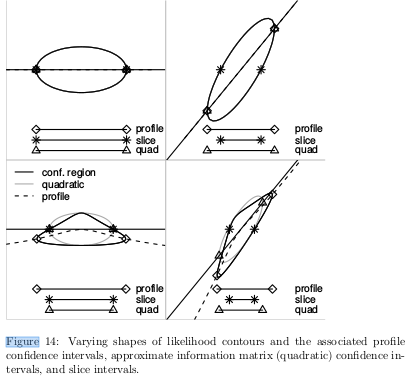

Daniel Park asked what I thought about profile likelihood vs integrated-likelihood CIs. This sparked thoughts about the connections between integrated likelihood, $t$ distributions, and REML. I've always vaguely thought that the standard $t$-based CIs on the mean of a Gaussian sample could be derived as an integrated likelihood (where a profile CI would give $Z$-based CIs instead), and that we could therefore think heuristically of integrated likelihood as a way to correct for some of the asymptoticness (?) of likelihood-based estimates. Here is a brain dump:

- Daniel was right that $\sum (x-\bar x)^2/(n+1)$ is the [minimum MSE estimator of variance of a Gaussian](https://stats.stackexchange.com/questions/84124/estimate-of-variance-with-the-lowest-mean-square-error) (whereas dividing the SSQ by $n$ gives the MLE and dividing by $n-1$ gives an unbiased estimator).
- from GLMM FAQ discussion of [REML for GLMMs](http://bbolker.github.io/mixedmodels-misc/glmmFAQ.html#reml-for-glmms):

> @millar_maximum_2011 and @berger_integrated_1999 are possible starting points in the peer-reviewed literature, and there are mailing-list discussions of these issues [here](https://stat.ethz.ch/pipermail/r-sig-mixed-models/2009q1/002104.html) and [here](http://lists.admb-project.org/pipermail/users/2011-June/001224.html).

@berger_integrated_1999 is pretty technical and doesn't seem to make an explicit connection between integrated likelihood and REML (or Student-$t$ tests).

- You only get exact equivalence between paired t-test and random-intercept mixed model ANOVA if the estimated among-group variance is positive; otherwise you need to use a compound-symmetric model that allows negative correlation, as in [this example](https://stat.ethz.ch/pipermail/r-sig-mixed-models/2011q2/016300.html)
```{r eval=FALSE}
(a2 <- anova(lme(prevalence~sex,
                 random=list(tripsite=pdCompSymm(~sex-1)),
                 data=dat,method="REML")))
(fstat2 <- a2[["F-value"]][2]) # you get 0.789627
```
- $t$ distribution as a scale mixture of Normals (i.e. mean=0, $1/\sigma^2 \sim \Gamma(\alpha,\beta)$): derivation [here](https://stats.stackexchange.com/questions/52906/student-t-as-mixture-of-gaussian). *Does the likelihood of $\{\mu=\bar x,\tau=1/\sigma^2\}$ for a Gaussian sample have the functional form of a Gamma distribution (i.e. $L(\tau) \propto \tau^n \exp(-\tau)$)*?
- Student's derivation of the $t$ test is instead based on the distribution of the ratio of a Gaussian random variable ($\bar x$) and a scaled $\chi^2$ random variable ($s$) ([Wikipedia](https://en.wikipedia.org/wiki/Student%27s_t-distribution#Derivation)). *Is there a connection, or formal similarity, between this calculation (distribution of ratios of random variables) and the scale-mixture integral?*
- It would be neat to try draw a figure analogous to Figure 6.14 of @Bolker2008:



... but that also (or instead) compared the profile CI to the integrated-likelihood CI. Might need a 3D picture.

- integrated likelihood via Laplace approximation: all we had to do to add REML via integrated likelihood into `glmmTMB` was add the following line (in [this commit](https://github.com/glmmTMB/glmmTMB/commit/18944952b9921bf2b240f84d9aa74a6ca8db84fe)):
```{r eval=FALSE}
if (REML) randomArg <- c(randomArg, "beta")
```
this flags the fixed-effect parameters as "random" arguments that have the Laplace approximation applied to them. Empirically, for LMMs this gives the same answer (up to numeric fuzz) as `lmer(...,REML=TRUE)`.

- Most commonly (e.g. in `nlme` and `lme4`) REML is done instead by using some linear algebra to transform the data so the fixed effects are zero; @bates_fitting_2015 ("The REML Criterion", eqs. 36-41) show that this is equivalent to 

> ... integrating the marginal density for $Y$ with respect to the fixed effects [@laird_random-effects_1982]

and that the integral simplies to an expression that is a modified form of the likelihood.
Equivalently, [this SO answer](https://stats.stackexchange.com/questions/48671/what-is-restricted-maximum-likelihood-and-when-should-it-be-used) describes REML as

> applying ML to the least squares residuals, which are independent of the fixed effects. 

## References
