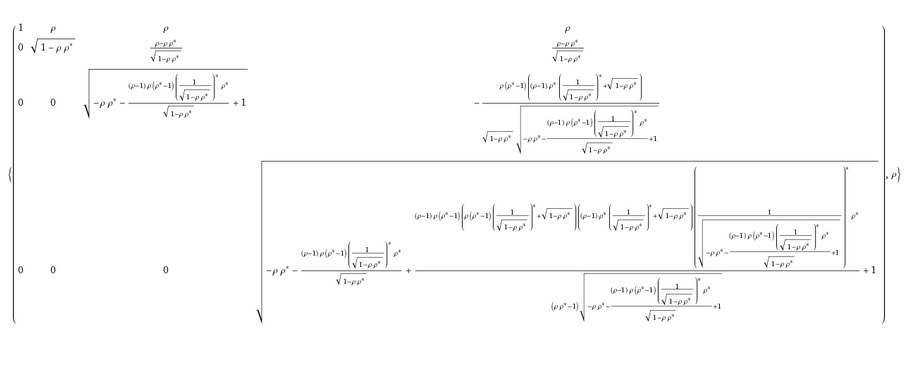

```{r pkgs}
library(lme4)
```

Simulate data (unstructured/"pdDiag").

```{r sim1,message=FALSE}
dd <- expand.grid(id=factor(1:20),rep=factor(1:20))
set.seed(101)
dd <- transform(dd,x=rnorm(nrow(dd)),y=rnorm(nrow(dd)))
dd$z <- simulate(~1+ (x+y|id),
                 family=gaussian,
                 newdata=dd,
                 newparams=list(beta=1,
                                theta=rep(1,6),
                                sigma=1))[[1]]
```

- The recipes below will work for any GLMM/response distribution, but sticking to a Gaussian response for now will make it easier to compare with the results of `lme`.
- In general, in keeping with `lme4`'s general approach, I'm going to fit models on *constrained* parameter spaces (e.g. keeping correlation parameters between -1 and 1 and standard deviations >0, rather than transforming to fit them on the logit and log scales, respectively)

## Full (unstructured but pos-def symmetric: `pdSymm`)

```{r fit1}
lmod <- lFormula(z ~ 1 + (x+y|id), data=dd)
devfun <- do.call(mkLmerDevfun, lmod)
```

Optimize the deviance function:

```{r regfit}
opt_Symm <- optimizeLmer(devfun)
VarCorr(m_Symm <- mkMerMod(environment(devfun), opt_Symm, lmod$reTrms, fr = lmod$fr))
```

This follows the steps shown in `?modular`: it's equivalent to what we would get from `lmer(...)`.

## multiple of identity matrix

This is equivalent to `nlme`'s `pdIdent` class.

```{r Ident}
wrap_Ident <- function(theta) {
  tvec <- c(theta,0,0,theta,0,theta)
  devfun(tvec)
}
opt0 <- optim(par=1,wrap_Ident,method="Brent",lower=0,upper=100)
opt_Ident <- with(opt0,list(par=par,fval=value,conv=convergence,
                            message=message))
VarCorr(m_Ident <- mkMerMod(environment(devfun), opt_Ident, lmod$reTrms, fr = lmod$fr))
```

We have to go a little out of our way to do 1-D derivative-free (and bounded) optimization.  The upper bound must be finite, but 100 is a reasonable upper bound (the variance here is scaled relative to the residual std dev).

## diagonal, heterogeneous variances

This is equivalent to `nlme`'s `pdDiag` class

```{r Diag}
wrap_Diag <- function(theta) {
  tvec <- c(theta[1],0,0,theta[2],0,theta[3])
  devfun(tvec)
}
opt_Diag <- nloptwrap(par=rep(1,3),wrap_Diag,lower=rep(0,3),upper=rep(Inf,3))
VarCorr(m_Diag <- mkMerMod(environment(devfun), opt_Diag, lmod$reTrms, fr = lmod$fr))
```

Checking the environment for `pd*` and `cor*` functions from `lme`, which may be useful in determining Cholesky factors ...

```{r find_struct,message=FALSE}
library(nlme)
apropos("^pd[^f]")
apropos("^cor[A-Z]")
## ?pdFactor
```

## AR1: homogeneous variances

Stole some nice code from [here](https://blogs.sas.com/content/iml/2018/10/03/ar1-cholesky-root-simulation.html)
	
```{r ar1_chol}
## direct computation of Cholesky root for an AR(1) matrix
ar1_chol <- function(rho,p) {
  R <- matrix(0,p,p)
  R[1,] <- rho^(0:(p-1))        ## formula for 1st row
  cc <- sqrt(1 - rho^2);        ## scaling factor: c^2 + rho^2 = 1
  R2 <-  cc * R[1,]             ## formula for 2nd row */
  for (j in 2:p) {              ## shift elements in 2nd row for remaining rows
    R[j, j:p] <- R2[1:(p-j+1)] 
  }
  return(R)
}
```

Could also use `nlme:::corAR1()`, get `corFactor()` (the inverse cholesky factor), and unpack it, but this seems easier.

We're going to assume here that the `id` values are AR1 (e.g. `id` values represent sequential measurements ...

```{r AR1}
## keep messing up devfun??
## devfun <- do.call(mkLmerDevfun, lmod)
wrap_AR1 <- function(theta) {
  cc <- ar1_chol(theta[2],p=3)
  tvec <- t(cc)[lower.tri(cc,diag=TRUE)]*theta[1]
  d <- devfun(tvec)
  ## cat(theta,d,"\n")
  return(d)
}
opt_AR1 <- nloptwrap(par=c(1,0),wrap_AR1,lower=c(0,-0.49),upper=c(Inf,1))
VarCorr(m_AR1 <- mkMerMod(environment(devfun), opt_AR1, lmod$reTrms, fr = lmod$fr))
```

## AR1: heterogeneous variances

```{r AR1het}
wrap_AR1het <- function(theta) {
  n <- length(theta)
  cc <- ar1_chol(theta[n],p=n-1)
  tvec <- sweep(t(cc),1,theta[-n],"*")
  tvec <- tvec[lower.tri(tvec,diag=TRUE)]
  d <- devfun(tvec)
  return(d)
}
opt_AR1het <- nloptwrap(par=c(1,2,3,0.5),
                        wrap_AR1het,
                        lower=c(rep(0,3),-0.49),
                        upper=c(rep(Inf,3),1))
VarCorr(m_AR1het <- mkMerMod(environment(devfun),
                             opt_AR1het, lmod$reTrms, fr = lmod$fr))
```

## compound symmetry

This might actually be the **hardest** case. We'd like to directly compute the Cholesky factor of a compound symmetric matrix, but it doesn't seem to be very practical. I tried things like:

<pre>
FullSimplify[CholeskyDecomposition[((1,rho,rho),(rho,1,rho),(rho,rho,1))], Element[rho,Reals]]
</pre>
(note that the parens `()` in this expression should actually be brackets `{}`: this confused GitHub pages for some reason)

in Wolfram Alpha.

For 3 $\times$ 3 the result simplifies to:

$$
\begin{split}
A & = \sqrt{1-\rho^2} \\
 & \left(\begin{array}{ccc} 
1 & \rho & \rho \\
0 & A & \rho(1-\rho)/A \\
0 & 0 & \sqrt{-\rho^2 - \rho^2((\rho-1)^2)/A^2 + 1}
\end{array}
\right)
\end{split}
$$

but for 4 $\times$ 4 it is:



```{r compsymm}
library(nlme)
x <- c(-1,-1)
attr(x,"ncol") <- 3
m <- matrix(nlme:::pdFactor.pdCompSymm(x),3,3)
crossprod(m,m) ## is indeed cs
## but NOT lower-triangular
```

```{r}
cc <- function(rho) {
  A <- sqrt(1-rho^2)
  matrix(c(1,rho,rho,
           0,A,rho*(1-rho)/A,
           0,0,
           sqrt(-rho^2-rho^2*((rho-1)^2)/A^2+1)),
         byrow=TRUE,nrow=3)
}
crossprod(cc(0.5),cc(0.5))
```

## comp symm, homogeneous variance

```{r CShom}
wrap_CShom <- function(theta=c(1,0.1)) {
  rho <- theta[2]
  sd <- theta[1]
  m <- matrix(rho,3,3)
  diag(m) <- 1
  cc <- t(chol(m))*sd
  tvec <- cc[lower.tri(cc,diag=TRUE)]
  devfun(tvec)
}
opt_CShom <- nloptwrap(par=c(1,0.1),wrap_CShom,lower=c(0,-1/2),upper=c(Inf,1))
VarCorr(m_CShom <- mkMerMod(environment(devfun),
                            opt_CShom, lmod$reTrms, fr = lmod$fr))
```

## heterogeneous diagonal

```{r CShet}
wrap_CShet <- function(theta=c(rep(1,3),0.1)) {
  rho <- theta[length(theta)]
  sd <- theta[-length(theta)]
  m <- matrix(rho,3,3)
  diag(m) <- 1
  m <- m * outer(sd,sd)
  cc <- t(chol(m))
  tvec <- cc[lower.tri(cc,diag=TRUE)]
  devfun(tvec)
}
opt_CShet <- nloptwrap(par=c(rep(1,3),0.1),
                  wrap_CShet,
                  lower=c(rep(0,3),-1/2),
                  upper=c(rep(Inf,3),1))
VarCorr(m_CShet <- mkMerMod(environment(devfun), opt_CShet,
                            lmod$reTrms, fr = lmod$fr))
```

## To do

- compare with `lme`/`glmmTMB` fits where possible?
- revive/redo flexLambda!
- comment on/compare with Lambda-hacking
- phylo examples
- Toeplitz/Kronecker examples?
